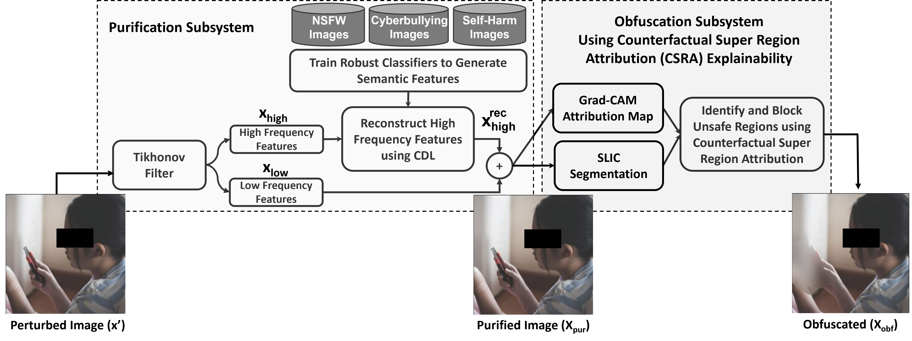

# Code for paper "Towards Targeted Obfuscation of Adversarial Unsafe Images using Reconstruction and Counterfactual Super Region Attribution Explainability"
Accepted at USENIX Security 2023

# Paper Abstract
Online Social Networks (OSNs) are increasingly used by perpetrators to harass their targets via the exchange of unsafe images. Furthermore, perpetrators have resorted to using advanced techniques like adversarial attacks to evade the detection of such images. To defend against this threat, OSNs use AI/ML-based detectors to flag unsafe images. However, these detectors cannot explain the regions of unsafe content for the obfuscation and inspection of such regions, and are also critically vulnerable to adversarial attacks that fool their detection. In this work, we first conduct an in-depth investigation into state-of-the-art explanation techniques and commercially-available unsafe image detectors and find that they are severely deficient against adversarial unsafe images. To address these deficiencies we design a new system that performs targeted obfuscation of unsafe adversarial images on social media using reconstruction to remove adversarial perturbations and counterfactual super region attribution explainability to explain unsafe image segments, and created a prototype called uGuard. We demonstrate the effectiveness of our system with a large-scale evaluation on three common unsafe images: Sexually Explicit, Cyberbullying, and Self-Harm. Our evaluations of uGuard  on more than 64,000 real-world unsafe OSN images, and unsafe images found in the wild such as sexually explicit celebrity deepfakes and self-harm images show that it significantly neutralizes the threat of adversarial unsafe images, by safely obfuscating 91.47\% of such images.


## System Architecture



# Download Code

```bash
git clone https://github.com/SecureAIAutonomyLab/uGuard.git
cd uGuard
```


# Build Environment

```
cd uGuard
conda env create -f environment.yml
```

# Usage
There are two main components of the uGuard system:
1. Reconstruction component to remove adversarial perturbation
2. Explainability-based unsafe image obfuscation

Provided with 

We provided scripts to run these in uGuard/scripts

## Data
Due to the sensitive nature of the images used in our experiments, we will not make the images publicly available, however, our method should be extendible to other datasets.

## Image Reconstruction
The image reconstruction code in this repository is designed to clean adversarial perturbations based on a binary classification problem. However, as shown by Silva et al. [1], this approach is generalizable to multi-class classification problems. We are not planning on making any changes to this code to make it generalizable to mutli-class classification, but the structure is there for anyone willing to experiment with it

## Explainability-Based Content Obfuscation
The CSRA algorithm implementation in this repository is inefficient and not generalized to different image sizes or to grayscale images. We are currently working on an improvement to the CSRA algorithm that also has a generalized implementation. From our initial experiments, it is much faster and provides strictly better performance for discovering counterfactual examples. We will link that repository here when we make it available.


# References
[1] Silva, S. H., Das, A., Aladdini, A., & Najafirad, P. (2022, May). Adaptive Clustering of Robust Semantic Representations for Adversarial Image Purification on Social Networks. In Proceedings of the International AAAI Conference on Web and Social Media (Vol. 16, pp. 968-979).
